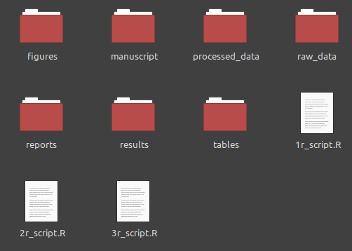

# Overview  
  
.pull-left[
<br> 
**Today**

- Tidy project structure  
  
- Troubleshooting  
  
- PBDB data  
  
- Binning of time series  
  
- Sample-standardization
]

--

.pull-right[
<br> 
**Tomorrow**  
  
- Tidy data
  - import data
  - tibbles  


- Tidyverse  
  - wrangle
  - iterate
  - visualize
  
]

```{r setup, include=FALSE}
options(htmltools.dir.version = FALSE)
library(tidyverse)
```
  
```{r xaringanExtra-search, echo=FALSE}
xaringanExtra::use_search(show_icon = FALSE, 
                          case_sensitive = FALSE)
```  
  
```{r xaringan-tile-view, echo=FALSE}
xaringanExtra::use_tile_view()
```  

```{r xaringan-panelset, echo=FALSE}
xaringanExtra::use_panelset()
```
---
class:inverse, mline, center, middle
# Tidy project structure

---
# Project structure  
  
.center[]

.footnote[
[Youtuber Rachelleea](https://www.youtube.com/channel/UCJCgaQzY5z5sA-xwkwibygw)
]
---
# Project structure  

.pull-left[
<br> 
**Problem**

- absolute paths
  
- `rm(list = ls())`

- non-reproducible results  
  
- total mess
]

--

.pull-right[
<br> 
**Solution**  
  
- Rstudio projects


- The `here` package  
  
- disenable workspace preservation
]

---
# What is real?  
  

.center[
]

---
# R projects 

.center[]

---
# R projects

.center[]

---
# R projects

.center[]  
  
---
# R projects  

.center[]

---
# Folder structures

.center[]  
  
---
# Here Package

<!-- .center[]   -->

.center[
]

---
# Troubleshooting  

.center[]  

---
class:inverse, mline, center, middle
  
# PBDB Data

---
# Paleobiology Database  
  
[Download records](https://paleobiodb.org/classic/displayDownloadGenerator)

- either directly via the website
  
- or via the generated URL  
  
- both access the API to the database  
  
- carefully read the [documentation](https://paleobiodb.org/data1.2/)

.pull-right[]  
  
---
# Binning observations  
 
.pull-left[
**Problem**
- huge uncertainty around fossil ages  
  
- uneven spaces between occurrences

]

.pull-right[
**Solution**  
  
- binning occurrences
  - assigning similarly aged fossils to a shared temporal unit  
  
  
- coarsen the resolution
]  
  
---
# Binning observations  

.center[
```{r, echo=FALSE, fig.width=12}
tibble(x = seq(1, 80, length.out = 4),
       xmin = c(1, 6, 30, 41), 
       xmax = c(12, 20, 60, 45), 
       y = 1:4) %>% 
  ggplot(aes(x, y, xmin = xmin, xmax = xmax)) +
  geom_linerange(size = 2, colour = "grey30") +
  labs(y = NULL, x = "Time [myr]") +
  scale_y_continuous(breaks = NULL) +
  scale_x_reverse() +
  theme_minimal(base_size = 20)
```
]  
  
---
# Binning observations  

.center[
```{r, echo=FALSE, fig.width=12}
tibble(x = seq(1, 80, length.out = 4),
       xmin = c(1, 6, 30, 41), 
       xmax = c(12, 20, 60, 45), 
       y = 1:4) %>% 
  ggplot(aes(x, y, xmin = xmin, xmax = xmax)) +
  geom_vline(xintercept = c(0, 20, 40, 60, 80)) +
  geom_linerange(size = 2, colour = "grey30") +
  labs(y = NULL, x = "Time [myr]") +
  scale_y_continuous(breaks = NULL) +
  scale_x_reverse() +
  theme_minimal(base_size = 20) 
```
]  
  
---
# Binning observations

.panelset[
.panel[.panel-name[R Code]

```{r histogram, fig.show='hide', fig.width=12, warning=FALSE, message=FALSE}
library(divDyn)
data("corals")

corals %>%
  mutate(age_range = abs(max_ma - min_ma)) %>%
  ggplot(aes(x = age_range)) +
  geom_histogram(binwidth = 0.5) +
  labs(x = 'Age range (myr)', y = 'Count') +
  theme_minimal(base_size = 20)
```
]

.panel[.panel-name[Plot]

`)
]
]

---
# Sample standardization

 
.pull-left[
**Problem**
- Data are samples
  - but we want to make inferences about populations
  
  
- number of species increases with the number of individuals samples
  
  
- comparison of collection of samples
  - invalid with different numbers of counted individuals 
  
  
]

.pull-right[
**Solution**  
  
- Sampling standardization 
  
  
- Previously: Classical rarefaction  
  
- Better: Shareholder Quorum Subsampling (SQS)<sup>1</sup>
]  

.footnote[
[1] [Alroy 2010](https://onlinelibrary.wiley.com/doi/pdf/10.1111/j.1475-4983.2010.01011.x)
]

---
# SQS

- an algorithm samples until taxa whose combined relative abundance exceeds a given threshold
  - threshold called the quorum  
  
  
- final results not dependent on quorum, but values between 0.3 and 0.7 are most commonly used


- options to exclude singletons (species occuring only once in a sample) and dominants (the most abundant taxon)
  - only relevant for small data sets

---
class:inverse, mline, center, middle

# It's your turn  
  
---
# Task

- set up a tidy project
 
 
- go to the [PBDB](https://paleobiodb.org/classic/displayDownloadGenerator) and download some data you are interested in 
  - either directly or just save the URL to load the data from within R
  
  
- go through the `exercise_paleo.R` file

<!--  -->

.center[
]